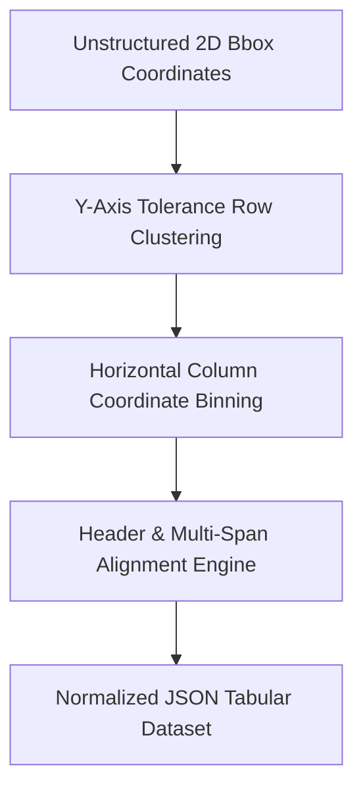

# GenPark AI Agent Skill - PDF Complex Merged Table Bbox Parser

Reconstructs structured tabular data from raw unstructured 2D bounding boxes, aligning multi-column headers and borderless cells.

Verified by [GenPark AI](https://genpark.ai) and compatible with [Model Context Protocol (MCP)](https://genpark.ai/mcp).

## Architecture Diagram

## Features
- **Zero External Dependencies**: Standard library Python 3.9+.
- **Robust Coordinate Clustering**: Absorbs OCR vertical jitter and baseline drifts.
- **MCP Protocol Ready**: Easily exposed to document analysis pipelines.
